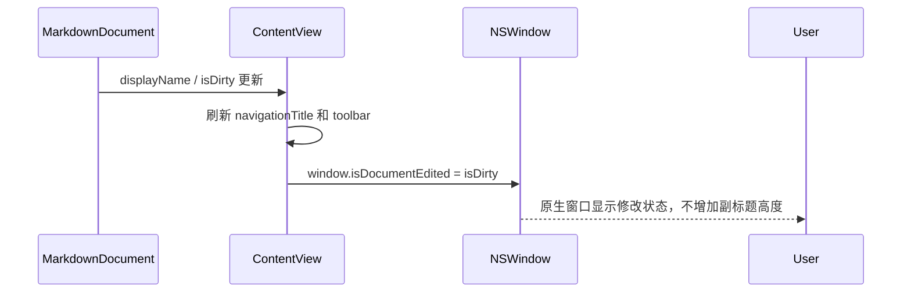

# 设计文档：收紧 App 窗口顶部导航栏高度（compact-window-toolbar）

Spec Type: Feature
Workflow: requirements-first
Status: Design Draft
Review Status: confirmed

## 概述

本设计通过减少窗口顶部标题栏/工具栏中会造成垂直撑高的元素，来让 App 顶部区域更紧凑。现有窗口已使用 `window.toolbarStyle = .unifiedCompact`，但 `ContentView` 同时设置了 `navigationSubtitle(document.isDirty ? "已修改" : "")`，这会让标题区域在有修改状态时出现副标题占位，增加顶部区域高度。

本次改动采用原生窗口能力：保留 `navigationTitle(document.displayName)` 作为文档身份，不再使用 `navigationSubtitle` 表达修改状态；将修改状态转移到窗口的文档修改标记（`NSWindow.isDocumentEdited`）和可选标题后缀中；同时进一步收紧工具栏模式按钮的尺寸与间距。

不做范围：不自绘标题栏，不替换系统窗口按钮，不改变编辑器/预览器主布局，不新增偏好设置。

## 架构

### 现有结构

```text
ContentView
  ├─ navigationTitle(document.displayName)
  ├─ navigationSubtitle(document.isDirty ? "已修改" : "")
  └─ toolbar
      └─ modeButton(...)

AppDelegate
  └─ registerWindow(...)
      └─ window.toolbarStyle = .unifiedCompact
```

### 目标结构

```text
ContentView
  ├─ navigationTitle(compactTitle)
  ├─ toolbar
  │   └─ compact modeButton(...)
  └─ onChange(document.isDirty)
      └─ window.isDocumentEdited = document.isDirty

AppDelegate
  └─ registerWindow(...)
      └─ window.toolbarStyle = .unifiedCompact
```

## 组件与接口

### 1. `ContentView`

**职责**：定义窗口顶部可见标题、视图模式切换工具栏，以及主内容区域布局。

**变更**：

- 移除 `.navigationSubtitle(document.isDirty ? "已修改" : "")`，避免系统标题栏为副标题预留垂直空间。
- 保留 `.navigationTitle(document.displayName)`，继续显示当前文档名称。
- 将修改状态同步到当前窗口的 `isDocumentEdited`，让 macOS 原生窗口表现文档修改状态。
- 可按需要将标题文本调整为紧凑单行形式，例如已修改时显示 `未命名 *` 或继续只显示文档名，具体以系统修改标记为主。
- 收紧 `modeButton` 的 icon font、frame、背景圆角和 `HStack` spacing/padding，避免工具栏控件自身撑高。

### 2. `WindowAccessor`

**职责**：把 SwiftUI 视图解析到 `NSWindow`。

**变更**：

- 复用现有 `WindowAccessor`，不新增窗口查找机制。
- 在窗口解析后由 `ContentView` 或轻量辅助方法更新 `window.isDocumentEdited`。

### 3. `AppDelegate`

**职责**：窗口注册和 macOS 原生窗口样式配置。

**变更**：

- 保留 `window.toolbarStyle = .unifiedCompact`。
- 不新增自绘标题栏相关配置。
- 不改变窗口级关闭、保存、打开流程。

## 数据模型

不新增持久化数据模型。

运行时状态映射如下：

```text
MarkdownDocument.displayName -> navigationTitle
MarkdownDocument.isDirty     -> NSWindow.isDocumentEdited
EditorViewMode               -> compact toolbar selected state
```

## 流程



## 错误处理

- 如果 `WindowAccessor` 暂时无法取得窗口引用，则跳过 `isDocumentEdited` 同步，等待后续 SwiftUI 生命周期回调。
- 如果系统标题栏对长文档名做截断，沿用 macOS 默认行为，不做自定义布局干预。

## 测试策略

- 构建验证：运行 `swift build`，确保 App target 编译通过。
- 回归测试：运行 `swift test`，确保现有核心逻辑未受影响。
- 人工验证：启动 App 后观察顶部栏在未修改/已修改状态下高度稳定，切换三种视图模式，确认按钮可点击且主内容区域继续填满窗口。

## 正确性属性

### 属性 1：修改状态不再通过副标题撑高顶部栏

*对任意* 文档修改状态变化，`ContentView` 不应重新设置非空 `navigationSubtitle` 来表达修改状态。

**验证：需求 1.1、2.2、3.3**

### 属性 2：视图模式按钮紧凑但仍可用

*对任意* 当前视图模式，工具栏按钮应保持固定尺寸，选中状态只改变视觉样式，不改变按钮 frame。

**验证：需求 1.2、2.3、2.4**

## 风险

- `NSWindow.isDocumentEdited` 的视觉表现由系统决定，不同 macOS 版本可能表现略有差异；但它比副标题更符合原生文档窗口语义。
- 如果用户强烈希望继续看到明确的“已修改”文字，单纯移除副标题可能不够直观；可后续在标题单行后缀或工具栏小标记中补充，但不应重新引入副标题高度。
