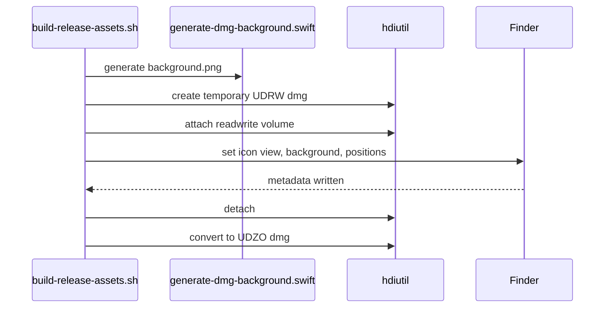

# 设计文档：DMG 安装界面优化（dmg-installer-ui）

Spec Type: Feature
Workflow: requirements-first
Status: Design Draft
Review Status: unreviewed

## 概述

本设计将 DMG 构建从简单 `hdiutil create -srcfolder` 调整为主流两阶段流程：

1. 准备 staging 目录，放入 `.app`、`Applications` 软链接、隐藏背景图。
2. 生成临时读写 DMG，挂载后通过 Finder AppleScript 设置窗口背景、图标位置、窗口尺寸和隐藏工具栏，再转换为最终压缩只读 DMG。

背景图由新增 Swift/AppKit 脚本生成，避免提交二进制设计源文件，也方便后续维护视觉尺寸和文案。

## 架构

### 现有架构

```text
build-release-assets.sh
  ├─ swift build
  ├─ dist/MarkdownEditor.app
  ├─ hdiutil create -srcfolder dmg-staging -> UDZO dmg
  └─ pkgbuild -> pkg
```

### 目标架构

```text
build-release-assets.sh
  ├─ swift build
  ├─ dist/MarkdownEditor.app
  ├─ generate-dmg-background.swift -> dmg-staging/.background/background.png
  ├─ hdiutil create -> temporary UDRW dmg
  ├─ hdiutil attach -> mounted volume
  ├─ osascript Finder layout
  ├─ hdiutil detach
  ├─ hdiutil convert -> final UDZO dmg
  └─ pkgbuild -> pkg
```

## 组件与接口

### 1. `scripts/generate-dmg-background.swift`

**职责**：生成安装窗口背景 PNG。

**变更**：

- 接收输出路径参数。
- 使用 AppKit 绘制 640x420 pt 背景。
- 绘制标题、说明、箭头和 subtle 面板背景。
- 输出 PNG 到指定路径。

**接口**：

```text
swift scripts/generate-dmg-background.swift <output-png>
```

### 2. `scripts/build-release-assets.sh`

**职责**：构建 release 产物，并写入 DMG Finder 元数据。

**变更**：

- 增加 DMG 相关常量：窗口尺寸、图标坐标、背景路径、临时 DMG 路径。
- staging 中创建 `.background/background.png`。
- 用 UDRW 临时镜像写 Finder 布局。
- 用 `trap` 清理临时挂载点、读写镜像和 staging 目录。
- 成功后转换为 UDZO 最终镜像。

**接口**：

```text
scripts/build-release-assets.sh [version]
```

## 数据模型

- Staging 目录：

```text
dist/dmg-staging/
├── MarkdownEditor.app
├── Applications -> /Applications
└── .background/
    └── background.png
```

- Finder 窗口布局：

```text
window bounds: {120, 120, 760, 540}
icon size: 128
MarkdownEditor.app position: {170, 220}
Applications position: {470, 220}
background: .background/background.png
```

## 流程



## 错误处理

- Swift 背景图脚本失败：release 脚本停止。
- `hdiutil attach` 失败：release 脚本停止并清理 staging。
- Finder AppleScript 失败：release 脚本停止并尝试 detach。
- `hdiutil detach` 失败：release 脚本停止，避免转换不完整镜像。

## 安全与隐私

- 不访问用户数据目录，仅构建 `dist/` 内产物和临时挂载点。
- AppleScript 仅操作当前构建挂载的 DMG 窗口。

## 性能与可靠性

- 背景图生成开销很低。
- UDRW 转 UDZO 是 macOS DMG 定制布局的常见流程。
- 通过 `sync` 和 Finder `update without registering applications` 降低元数据未落盘风险。

## 测试策略

- 静态测试：`bash -n scripts/build-release-assets.sh`。
- 背景图测试：运行 `swift scripts/generate-dmg-background.swift /tmp/background.png` 并检查输出图片存在且非空。
- 构建测试：运行 `scripts/build-release-assets.sh 0.0.0-test`，验证 DMG/PKG 生成。
- 手动验收：挂载 DMG，检查窗口背景、图标位置和拖拽安装体验。

## 正确性属性

### 属性 1：最终 DMG 不包含临时读写镜像

*对任意* 版本号，构建完成后 `dist/MarkdownEditor-<version>.dmg` 应存在，`dist/MarkdownEditor-<version>-rw.dmg` 应不存在。

**验证：需求 3.2、3.3**

### 属性 2：安装窗口包含必要入口

*对任意* 成功构建的 DMG，镜像根目录应包含 `MarkdownEditor.app` 和 `Applications` 软链接。

**验证：需求 1.2、3.1**

## 风险

- Finder AppleScript 依赖图形会话：在纯 CI 环境中可能失败，需要后续为 CI 增加可选无布局模式。
- 背景图文案偏英文：更贴近主流 DMG，但若产品定位中文用户，可后续切换为中文文案。

## 待确认问题

- 是否需要在 CI 中保留一个 `SKIP_DMG_LAYOUT=1` 的降级开关？
