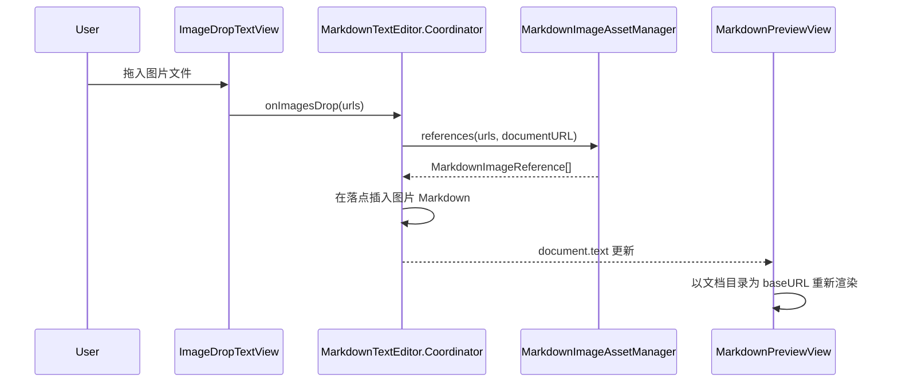

# 设计文档：拖拽图片插入当前文档（drag-image-into-editor）

Spec Type: Feature
Workflow: requirements-first
Status: Design Draft
Review Status: unreviewed

## 概述

本设计在现有拖拽识别能力上补齐“当前文档感知”的图片处理。核心改动是让 `ContentView` 将 `MarkdownDocument.fileURL` 传入编辑器和预览器；编辑器拖入图片时使用一个纯 Foundation 的资源管理器决定复制位置和 Markdown 路径；预览器使用文档所在目录作为 HTML base URL，从而支持相对图片路径。

不做范围：不实现保存时自动迁移未保存文档中的绝对路径图片，不修改截图粘贴的临时目录策略，不新增偏好设置。

## 架构

### 现有架构

```text
MarkdownDocument
  └─ text binding
      ├─ MarkdownTextEditor
      │   └─ ImageDropTextView -> Coordinator.insertImageMarkdown(urls:)
      └─ MarkdownPreviewView(markdownText:)
```

### 目标架构

```text
MarkdownDocument
  ├─ text binding
  └─ fileURL
      ├─ MarkdownTextEditor(text:, documentURL:)
      │   └─ MarkdownImageAssetManager -> Markdown image references
      └─ MarkdownPreviewView(markdownText:, baseURL:)
```

## 组件与接口

### 1. `MarkdownImageAssetManager`

**职责**：根据当前文档 URL 和拖入图片 URL，复制图片资源并生成 Markdown 可用引用。

**变更**：

- 新增到 `MarkdownEditorCore`，便于单元测试。
- 当 `documentURL` 存在时复制到同级 `<文档名>.assets`。
- 当 `documentURL` 不存在时返回源图片绝对路径。
- 对文件名冲突生成 `name-1.ext`、`name-2.ext` 等唯一文件名。
- 对 Markdown 路径进行 URL path percent encoding。

**接口**：

```swift
public struct MarkdownImageReference: Equatable {
    public let altText: String
    public let markdownPath: String
}

public enum MarkdownImageAssetManager {
    public static func references(
        for sourceURLs: [URL],
        documentURL: URL?,
        fileManager: FileManager = .default
    ) throws -> [MarkdownImageReference]
}
```

### 2. `MarkdownTextEditor`

**职责**：将拖拽事件转换为文档文本插入。

**变更**：

- 新增 `documentURL: URL?` 参数。
- `updateNSView` 中刷新 coordinator 的 parent，确保保存/另存后使用最新 URL。
- `Coordinator.insertImageMarkdown(urls:)` 调用 `MarkdownImageAssetManager`。
- 插入失败时显示 `NSAlert`，避免生成坏链接。

### 3. `MarkdownPreviewView`

**职责**：渲染 Markdown HTML 并加载本地图片。

**变更**：

- 新增 `baseURL: URL?` 参数。
- 预览 HTML 写入每个 WebView 独立的临时文件后通过 `loadFileURL(... allowingReadAccessTo: /)` 加载，继续支持绝对本地图片路径。
- 当 `baseURL` 存在时在 HTML `<head>` 注入 `<base href="文档目录/">`，让相对图片路径以当前文档目录解析。
- 未保存文档不注入 `<base>`，保留绝对路径图片加载能力。

### 4. `ContentView`

**职责**：把当前文档上下文传给编辑器和预览器。

**变更**：

- 所有 `MarkdownTextEditor` 调用传入 `document.fileURL`。
- 所有 `MarkdownPreviewView` 调用传入 `document.fileURL?.deletingLastPathComponent()`。

## 数据模型

- 资源目录：`<document-directory>/<document-base-name>.assets/`
- 插入路径：`<document-base-name>.assets/<encoded-file-name>`
- 多图插入文本：

```markdown


```

## 流程



## 错误处理

- 资源目录创建失败：显示“图片插入失败”，不插入 Markdown。
- 单个文件复制失败：抛出错误并显示源文件名与错误信息。
- 路径编码失败：退回原始相对路径，保持可读性。

## 安全与隐私

- 仅处理本地文件 URL。
- 不读取图片内容做网络上传或外部处理。
- 复制文件时不覆盖用户已有资源。

## 性能与可靠性

- 拖拽复制在主线程同步执行，适合常见小图；大图复制可能短暂阻塞，后续可异步化。
- 文件名冲突检测只在目标资源目录内进行。
- 多图处理要保持稳定顺序。

## 测试策略

- 单元测试：`MarkdownImageAssetManager` 的资源目录、唯一命名、未保存文档、路径编码。
- 集成测试：`swift test` 覆盖核心逻辑，构建确保 SwiftUI/AppKit 接口匹配。
- 端到端测试：手动运行 App 后从 Finder 拖入图片验证预览刷新。
- 回归测试：确保非图片拖拽仍走 `NSTextView` 默认行为。
- 属性测试候选：任意文件名输入生成的 Markdown path 不为空，且不会覆盖既有文件。

## 正确性属性

### 属性 1：拖入图片不覆盖既有资源

*对任意* 已存在的目标文件名，当处理同名拖入图片，系统应生成不同目标文件名并保留原文件。

**验证：需求 2.3**

### 属性 2：已保存文档生成相对路径

*对任意* 已保存 Markdown 文件和图片文件，当处理拖入图片，生成的 Markdown path 应不以 `/` 开头。

**验证：需求 2.2、4.1**

## 风险

- `WKWebView` 本地文件读取策略容易受加载方式影响：统一使用临时 HTML 文件和明确的 read access，降低已保存/未保存文档行为不一致的风险。
- 当前工作区已有未提交的 undo/redo 相关改动：实现时只做必要增量，不回退既有改动。

## 待确认问题

- 是否需要把截图粘贴也改成同样的资源目录策略？
